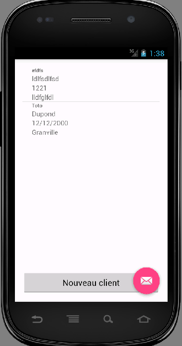
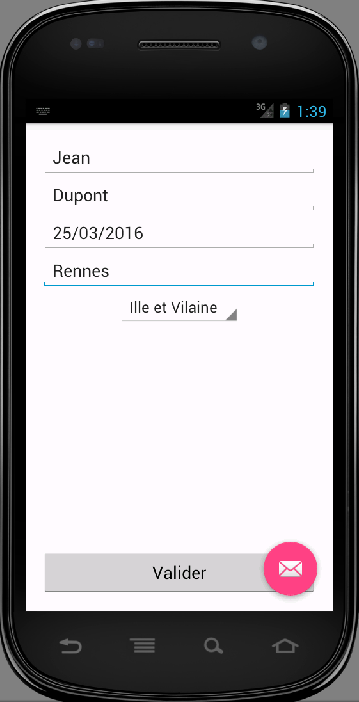

# Android TP1 et TP2 #

**BERNARD Tanguy**

### Objectif ###

Dans ce TP, il s’agit de déveloper une  Activity qui affichera sous la forme d’un ListView les différentes
données saisies dans l’Activity de l’exercice 1.1. Ces données seront ensuite stockées dans une BDD
SQLite via un ContentProvider. 

### Note ###
Cette version contient uniquement le TP2 qui vient écraser le code du TP1.
Dans le  package istic.fr.tp1.model; vous trouverez la classe Parcelable utiliser dans le TP1.
ET le code en commentaire dans la classe DisplayData activity:

User user = new User("Jean", "DUPOND", "25/03/2016", "Rennes");
Intent intent = new Intent(getBaseContext(), ContactEdit.class);
intent.putExtra("user", user);
startActivity(intent);

### Configuration  ###

* Nexus S API 15
* tester sur X86

### Installation ###

1. Récuperer le projet
2. Executer avec la configuration minimum requise

### Resultat ###

Sur smartphone :

  |  

